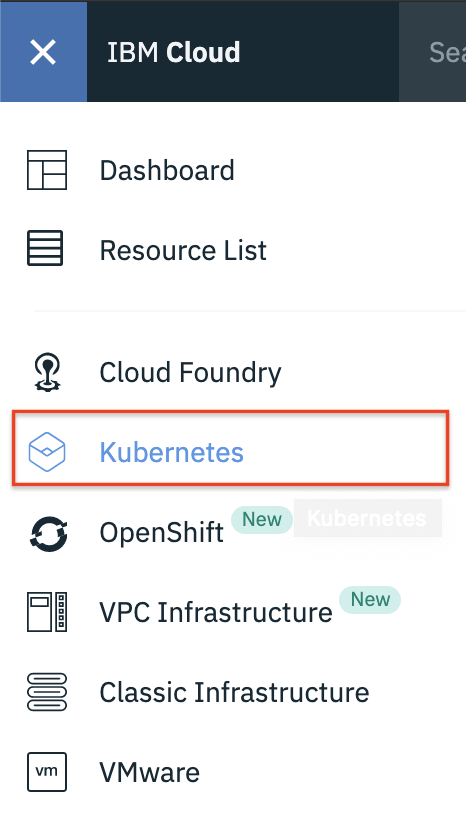
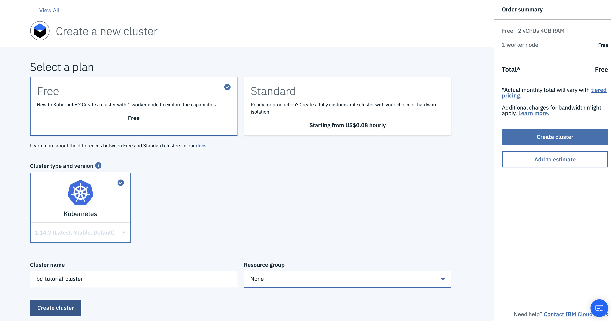
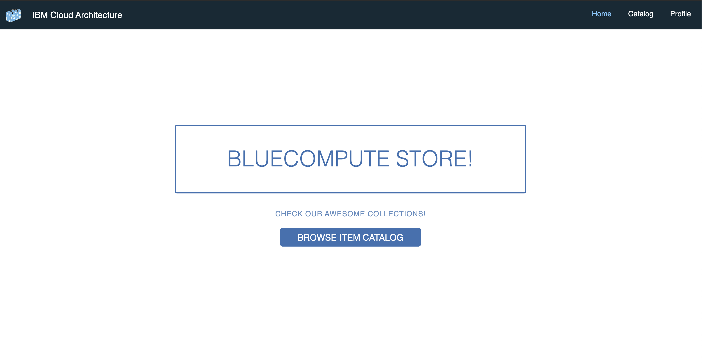
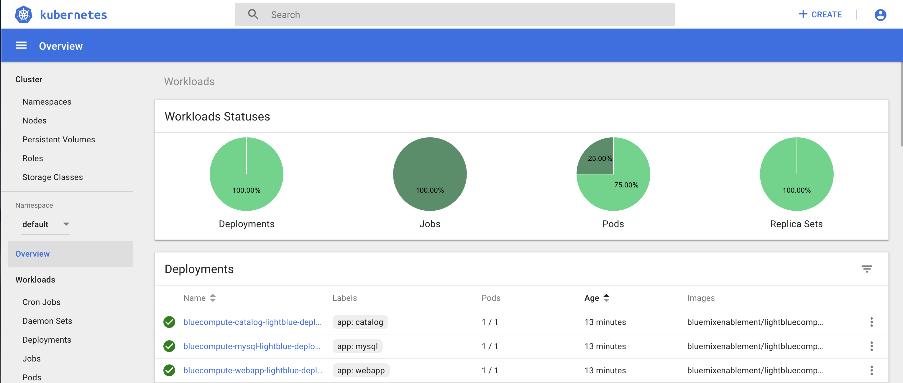

# Tutorial

In this tutorial, you install and run a cloud-native microservices app on IBM Cloud™ by using the IBM Cloud Kubernetes Service as a [Kubernetes cluster](https://www.ibm.com/garage/method/practices/run/tool_ibm_container). The app implements a simple storefront that displays a catalog of computing devices. Users can see the product catalog from the app's web interface and know the details of the products. For a reference implementation diagram for the app, see [LightBlueCompute architecture](https://github.com/ibm-cloud-architecture/light-bluecompute/blob/master/images/ref-arch.jpg).

As you install the app, you clone a [Git repository](https://www.ibm.com/garage/method/practices/code/tool_github/) (repo) that has several [microservices](https://www.ibm.com/cloud/garage/architectures/microservices). With microservices, you can partition your app into smaller independent services that communicate with each other. This structure allows your app to be developed, deployed, and managed by different teams. By implementing microservices, you can incorporate the [Circuit Breaker pattern](https://www.ibm.com/garage/method/practices/manage/practice_circuit_breaker_pattern/) into your app so that the app can remain partially operational if a single microservice becomes unavailable.

When you install the app, these components are included:

- A web app that provides the user interface through the web browser.
- The web app also acts as a BFF component, following the [Backends for Frontends](https://samnewman.io/patterns/architectural/bff/) pattern. In this layer, front-end developers usually write back-end logic for the front end. The Web BFF is implemented by using the Node.js Express Framework. These microservices are packaged as Docker containers and are managed by a Kubernetes cluster.
- The BFF invokes a layer of reusable microservices that are written in Java™. The Java microservices run inside [IBM Cloud Kubernetes Service](https://www.ibm.com/cloud/container-service) by using [Docker](https://www.docker.com/). The Java microservices retrieve their data from databases. The catalog service retrieves items from [MySQL](https://www.mysql.com/). In this example, you run MySQL in a Docker container for development. In a production environment, it runs on an Infrastructure as a Service (IaaS) layer, [IBM Cloud infrastructure](https://cloud.ibm.com/catalog?category=vpc).

## Prerequisites

1. You must have an IBM Cloud account. The account is free and provides access to everything you need to develop, track, plan, and deploy apps. [Sign up for a trial](https://cloud.ibm.com/registration?cm_mmc=IBMBluemixGarageMethod-_-MethodSite-_-10-19-15::12-31-18-_-bm_reg). The account requires an IBMid. If you don't have an IBMid, you can create one when you register.

If you're using an IBM Cloud user ID that was created as part of an IBM Cloud account that you don't manage, the Administrator service policy role must be assigned to your IBM Cloud user ID. Without that level of access, you can't create a cluster or deploy to a cluster by using the tools in this tutorial. To request the Administrator service policy role, contact the owner of your IBM Cloud account.

2. To install and test the app, your machine must be set up to run developer commands such as `git`.

- If you use a Linux system, make sure that you can run the commands and install the appropriate packages that allow you to do so.

- If you use a Windows system, install [Git](https://git-scm.com/downloads). After you download the file, open it and run the installation wizard. Accept all default installation options. After the installation is complete, on the command line, type `git` to see the Git instructions output.

- If you use a Mac system, install [Git](https://git-scm.com/download/mac). For detailed instructions, see [Installing on Mac](https://git-scm.com/book/en/v2/Getting-Started-Installing-Git).

4. Verify that Git is installed by entering this command in a terminal or on a command-line window:

```
git --version
```

You will see something like below.

```
$ git version
git version 2.20.1 (Apple Git-117)
```
## Task 1 - Install the IBM Cloud CLI and Container Service plug-in, the kubernetes CLI, and Helm

To install and test the app on IBM Cloud, you need these tools:

- IBM Cloud CLI
- IBM Cloud Kubernetes Service plug-in
- Kubernetes CLI ([kubectl](https://kubernetes.io/docs/reference/kubectl/overview/))
- [Helm](https://github.com/helm/helm), the Kubernetes package manager

1. The deployment requires the IBM Cloud Kubernetes Service plug-in. Ensure that the IBM Cloud Kubernetes Service plug-in is installed by entering this command:

```
ibmcloud ks help
```

If the plug-in is not installed, install the plug-in by entering this command:

```
ibmcloud plugin install container-registry -r 'IBM Cloud'
```

2. Install kubectl on your platform by following the instructions in the [Kubernetes documentation](https://kubernetes.io/docs/tasks/tools/install-kubectl/).

3. Install Helm on your platform by following these [instructions](https://github.com/helm/helm/blob/master/docs/install.md).

4. Ensure that the tools are installed by entering these commands:

```
ibmcloud --version
kubectl help
helm -h
```

You will see something like below.

```
$ ibmcloud --version
ibmcloud version 0.19.0+569dd56-2019-09-23T08:20:26+00:00
$ kubectl help
kubectl controls the Kubernetes cluster manager.

Find more information at: https://kubernetes.io/docs/reference/kubectl/overview/

Basic Commands (Beginner):
  create         Create a resource from a file or from stdin.
  expose         Take a replication controller, service, deployment or pod and
expose it as a new Kubernetes Service
  run            Run a particular image on the cluster
  set            Set specific features on objects

Basic Commands (Intermediate):
  explain        Documentation of resources
  get            Display one or many resources
  edit           Edit a resource on the server
  delete         Delete resources by filenames, stdin, resources and names, or
by resources and label selector

Deploy Commands:
  rollout        Manage the rollout of a resource
  scale          Set a new size for a Deployment, ReplicaSet, Replication
Controller, or Job
  autoscale      Auto-scale a Deployment, ReplicaSet, or ReplicationController

Cluster Management Commands:
  certificate    Modify certificate resources.
  cluster-info   Display cluster info
  top            Display Resource (CPU/Memory/Storage) usage.
  cordon         Mark node as unschedulable
  uncordon       Mark node as schedulable
  drain          Drain node in preparation for maintenance
  taint          Update the taints on one or more nodes

Troubleshooting and Debugging Commands:
  describe       Show details of a specific resource or group of resources
  logs           Print the logs for a container in a pod
  attach         Attach to a running container
  exec           Execute a command in a container
  port-forward   Forward one or more local ports to a pod
  proxy          Run a proxy to the Kubernetes API server
  cp             Copy files and directories to and from containers.
  auth           Inspect authorization

Advanced Commands:
  apply          Apply a configuration to a resource by filename or stdin
  patch          Update field(s) of a resource using strategic merge patch
  replace        Replace a resource by filename or stdin
  wait           Experimental: Wait for a specific condition on one or many
resources.
  convert        Convert config files between different API versions

Settings Commands:
  label          Update the labels on a resource
  annotate       Update the annotations on a resource
  completion     Output shell completion code for the specified shell (bash or
zsh)

Other Commands:
  alpha          Commands for features in alpha
  api-resources  Print the supported API resources on the server
  api-versions   Print the supported API versions on the server, in the form of
"group/version"
  config         Modify kubeconfig files
  plugin         Provides utilities for interacting with plugins.
  version        Print the client and server version information

Usage:
  kubectl [flags] [options]

Use "kubectl <command> --help" for more information about a given command.
Use "kubectl options" for a list of global command-line options (applies to all
commands).
$ helm -h
The Kubernetes package manager

To begin working with Helm, run the 'helm init' command:

	$ helm init

This will install Tiller to your running Kubernetes cluster.
It will also set up any necessary local configuration.

Common actions from this point include:

- helm search:    search for charts
- helm fetch:     download a chart to your local directory to view
- helm install:   upload the chart to Kubernetes
- helm list:      list releases of charts

Environment:
  $HELM_HOME          set an alternative location for Helm files. By default, these are stored in ~/.helm
  $HELM_HOST          set an alternative Tiller host. The format is host:port
  $HELM_NO_PLUGINS    disable plugins. Set HELM_NO_PLUGINS=1 to disable plugins.
  $TILLER_NAMESPACE   set an alternative Tiller namespace (default "kube-system")
  $KUBECONFIG         set an alternative Kubernetes configuration file (default "~/.kube/config")

Usage:
  helm [command]

Available Commands:
  completion  Generate autocompletions script for the specified shell (bash or zsh)
  create      create a new chart with the given name
  delete      given a release name, delete the release from Kubernetes
  dependency  manage a chart's dependencies
  fetch       download a chart from a repository and (optionally) unpack it in local directory
  get         download a named release
  history     fetch release history
  home        displays the location of HELM_HOME
  init        initialize Helm on both client and server
  inspect     inspect a chart
  install     install a chart archive
  lint        examines a chart for possible issues
  list        list releases
  package     package a chart directory into a chart archive
  plugin      add, list, or remove Helm plugins
  repo        add, list, remove, update, and index chart repositories
  reset       uninstalls Tiller from a cluster
  rollback    roll back a release to a previous revision
  search      search for a keyword in charts
  serve       start a local http web server
  status      displays the status of the named release
  template    locally render templates
  test        test a release
  upgrade     upgrade a release
  verify      verify that a chart at the given path has been signed and is valid
  version     print the client/server version information

Flags:
      --debug                           enable verbose output
      --home string                     location of your Helm config. Overrides $HELM_HOME (default "/Users/Hemankita.Perabathini@ibm.com/.helm")
      --host string                     address of Tiller. Overrides $HELM_HOST
      --kube-context string             name of the kubeconfig context to use
      --tiller-connection-timeout int   the duration (in seconds) Helm will wait to establish a connection to tiller (default 300)
      --tiller-namespace string         namespace of Tiller (default "kube-system")

Use "helm [command] --help" for more information about a command.
```

5. Install the [IBM Cloud CLI](https://cloud.ibm.com/docs/cli/reference/ibmcloud?topic=cloud-cli-install-ibmcloud-cli&cm_mmc=IBMBluemixGarageMethod-_-MethodSite-_-10-19-15::12-31-18-_-ibmcloud-cli-install&_ga=2.9071408.428156231.1571349383-306001710.1571349383#install_use).

## Task 2 - Provision a Kubernetes cluster on IBM Cloud Kubernetes Service

Kubernetes is an open source system for automating the deployment, scaling, and management of containerized apps. The IBM Cloud Kubernetes Service provides a highly secure, native Kubernetes experience for rapidly building cloud-native apps. This tutorial uses the IBM Cloud Kubernetes Service to create a managed Kubernetes cluster and deploy a cloud-native app to the cluster.

Two types of Kubernetes clusters are available in the IBM Cloud Kubernetes Service: Lite and Standard. The Lite tier is available at no cost. You can use it to provision a cluster with one worker node of type u1c.2x4 (2 core, 4 GB memory, 100 GB storage, 100 Mbps network). The Lite tier is sufficient to run the app.

With the Standard tier of the IBM Cloud Kubernetes Service, you can provision a cluster in a user-selected data center with a configurable number of worker nodes and a configurable number of worker node sizes. The cluster is provisioned in the linked IBM Cloud infrastructure account. With a Standard cluster, the ingress controller and load balancer are enabled.

For the purposes of this tutorial, you create a Lite Kubernetes cluster in the IBM Cloud Kubernetes Service.

1. From the menu, click **Kubernetes**.



2. Now click on **Create cluster** under **Kubernetes** cluster.


3. Select **Free** plan, name your cluster and then click **Create cluster**.



4. Wait till the cluster get created and you should be good to go once it is ready.

## Task 3 - Deploy the app to the cluster

You packaged all the application components as [Kubernetes Helm charts](https://github.com/helm/charts). You can now deploy the application by following the instructions to configure kubectl for access to the Kubernetes cluster.

1. Log in by using the API key to run the `kubectl` command.

```
ibmcloud login -a <your region's API endpoint> -r <your region> -g <your resource group> --apikey <your API key>
```

Get your api key by accessing `Manage > Access(IAM) > IBM Cloud API keys > Create an IBM Cloud API key`.

2. To set the Kubernetes environment variables, you need an export command. Retrieve the export command by entering the `ibmcloud ks cluster config` command:

```
ibmcloud ks cluster config --cluster <clustername>
```

3. Copy the resulting export command, which looks like this example:

```
export KUBECONFIG=/Users/ibm/.bluemix/plugins/container-service/clusters/cloudnativedev/kube-config-prod-mel01-cloudnativedev.yml
```

Paste the export command on the command line and run it.

4. Initialize Helm in your cluster:

```
helm init
```

The Helm client and the server side component, tiller, are initialized.

5. Add the helm package repository that contains the reference application:

```
helm repo add ibm-light-bc https://raw.githubusercontent.com/ibm-cloud-architecture/light-bluecompute/master/lightbluecompute/charts/release
```

6. Install the reference application:

```
helm install --name bluecompute ibm-light-bc/lightbluecompute
```

In few seconds, the containers are deployed to the cluster. The output of the installation contains instructions to access the application after it is deployed.

NOTE: If you get an error message as follows, add a serviceaccount to deploy tiller as given below.

```
Error: release bluecompute failed: namespaces "default" is forbidden: User "system:serviceaccount:kube-system:default" cannot get resource "namespaces" in API group "" in the namespace "default"
```

Add a serviceaccount to deploy tiller.

```
kubectl --namespace kube-system create serviceaccount tiller

kubectl create clusterrolebinding tiller-cluster-rule \
 --clusterrole=cluster-admin --serviceaccount=kube-system:tiller

kubectl --namespace kube-system patch deploy tiller-deploy \
 -p '{"spec":{"template":{"spec":{"serviceAccount":"tiller"}}}}'
```

For more information, see [Run a Cloud Native Microservices Application on a Kubernetes Cluster](https://github.com/ibm-cloud-architecture/light-bluecompute).

Also, there is an extended version of bluecompute. Currently, we are using light version of it for this tutorial. But if you wanted to check out more elaborate version of this app, refer to [Cloud Native Java Microservices - Reference implementation based on Kubernetes](https://github.com/ibm-cloud-architecture/refarch-cloudnative-kubernetes). We have it implemented in both Springboot and Microprofile.

8. Copy the application URL and paste it into your browser. Create a bookmark of the URL.



## Task 4 - Validate the app

The app is installed in your Kubernetes cluster. Now you can explore the app.

1. Click **Browse Item Catalog** to view the item catalog.


2. Click one of the items to open the detail page.


3. Explore the web app as much as you like.

## Task 5 - View the Kubernetes dashboard

The Kubernetes dashboard is the web-based user interface where you can deploy, modify, and view containerized application workloads on a Kubernetes cluster.

To see the dashboard, in the same command-line window where you deployed the app to the cluster, run the following commands. If you're using a different command-line window, complete step 1 and 2; otherwise, skip to step 3.

1. Log in to the application. If you need instructions to log in, see [step 5 of task 4](https://www.ibm.com/cloud/garage/tutorials/microservices-app-on-kubernetes?task=4).

2. To access the kubernetes dashboard, access your cluster and click on **Kubernetes Dashboard**.

3. The dashboard shows the different resources that are running on the cluster.



The BlueCompute app consists of different microservices, each of which are deployed to the Kubernetes cluster, as a deployment resource. Think of a deployment as the release unit of your app.

4. In the Workloads section, click **Deployments** to show the BlueCompute deployment resources that were installed.

Next, you'll explore pods. Pods are groups of containers that are deployed together on the same worker node. A pod is where the application code, which is packaged as a Docker container, runs under a Kubernetes context.

5. Click Pods to see the list of pods. Click a pod that starts with `bluecompute-catalogxxxx` to view the Catalog Pods page. On that page, you can check the pod runtime logs and see the Docker container instances.

Next, you'll explore services. Services are Kubernetes resources that define a logical set of pods and a policy to assess them. BlueCompute microservice components are exposed as services so that they can communicate among them and access each other. For example, the bluecompute-web service defines how users can access the web app.

6. In the "Discovery and Load balancing" section, click **Services** to see the list of services. From there, click **bluecompute-webapp-lightblue-service** to see what that service contains.

## Task 6 - Update the web application by using the Kubernetes CLI

**TBD**

## Task 7 - (Optional) Monitor the Kubernetes environment with Prometheus and Grafana

Cloud Service Management & Operations (CSMO) is important for cloud-native microservices-style apps.

To learn how to use the tools and services on IBM Cloud to implement CSMO for the microservice app, you can deploy a self-contained and independent monitoring stack into the Kubernetes cluster. Helm is Kubernetes package manager that facilitates the deployment of prepackaged, reusable Kubernetes resources. With the aid of Helm, the monitoring component, Prometheus, and the display component, Grafana, are deployed. After they are deployed, you can view the Grafana dashboard to monitor the app.

1. Get the below repository.

```
git clone https://github.com/ibm-cloud-architecture/refarch-cloudnative-kubernetes-csmo.git

cd refarch-cloudnative-kubernetes-csmo/
```

2. Install the Grafana and Prometheus components.

To get the ibm cloud region information, run `ibmcloud regions`.

```
$ ibmcloud regions
Listing regions...

Name            Display name
au-syd          Sydney
jp-osa          Osaka
jp-tok          Tokyo
kr-seo          Seoul
eu-de           Frankfurt
eu-gb           London
us-south        Dallas
us-south-test   Dallas Test
us-east         Washington DC
```

To get the cluster id, run `ibmcloud clusters`.

```
$ ibmcloud ks clusters
OK
Name                 ID                                 State      Created        Workers   Location          Version                   Resource Group Name
bc-tutorial          4de24b6b12bd461cacc0a85fa75a84d2   normal     5 months ago   3         Dallas            1.15.4_1518*              default
```

3. On a Mac or Linux system, enter this command:

```
./install_csmo.sh <cluster-name> <ibmcloud-api-key> <ibmcloud-region> <namespace> <resource-group>
```

For instance it will be as follows.

```
./install_csmo.sh bc-tutorial xxxxxxxxxxxxxxxxxxxxxxxxxx us-south default default
```

On a Windows system, enter this command:

```
install_csmo.bat <cluster-name> <ibmcloud-api-key> <ibmcloud-region> <namespace> <resource-group>
```

When the installation is completed, the Grafana URL and admin password are displayed.

4. Import the dashboards.

- On a Mac or Linux system, enter this command:

```
./import_dashboards.sh <grafana_url> <grafana_password>
```

- On a Windows system, enter this command:

```
import_dashboards.bat <grafana_url> <grafana_password>
```

5. You can now view the Grafana dashboard by typing the Grafana URL from step 2 in a web browser. For more information, see [CSMO for Kubernetes based Cloud Native Reference Application](https://github.com/ibm-cloud-architecture/refarch-cloudnative-kubernetes-csmo).

## Task 8 - (Optional) Delete the app from the cluster

You can delete the app from your cluster by running the below command.

```
helm delete --purge <chart-name>
```

For example, it will be as follows.

```
$ helm delete --purge bluecompute
release "bluecompute" deleted
```

## What's next

Can be the same as the existing one.

## Appendix 1: Install Kubernetes by using the command line

**TBD**
